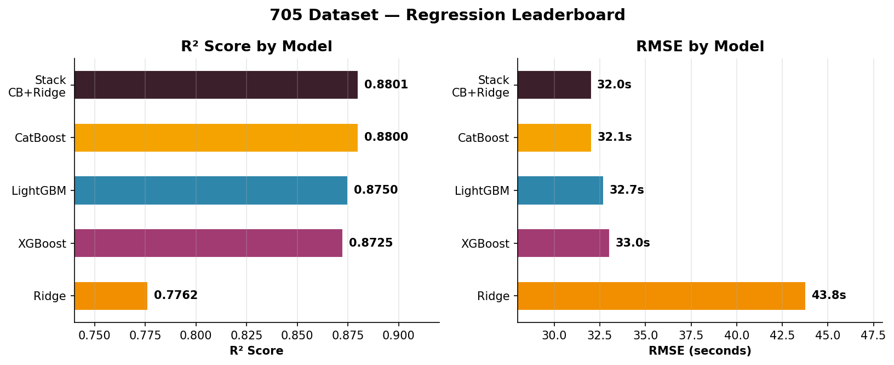
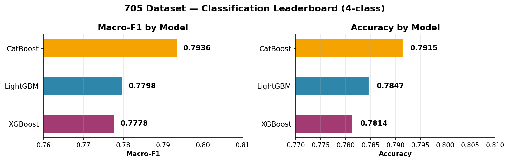
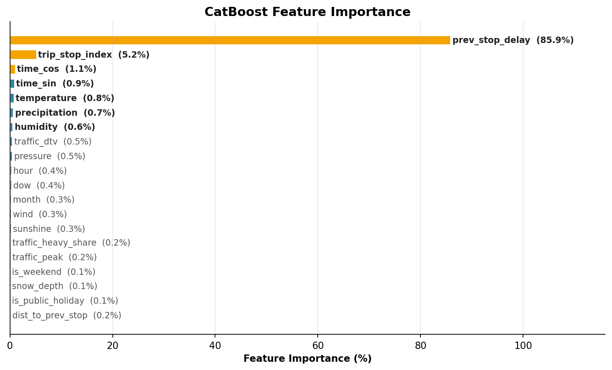
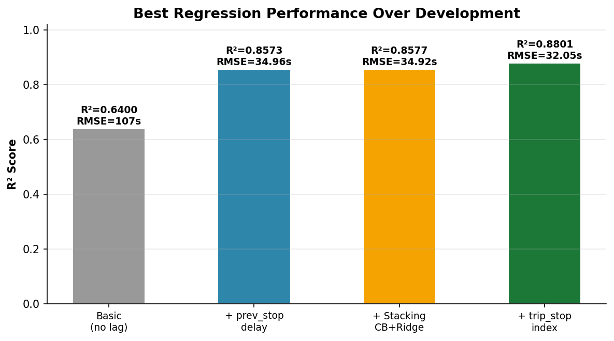

# Swiss Bus Delay Prediction

**Predicting bus arrival delays across Switzerland using gradient-boosted trees and real-time features.**

Machine learning models that predict how late a bus will be at each stop, using weather conditions, traffic data, upstream delays, and stop position within the trip. The best model achieves **R² = 0.88** on a dataset of 483,000+ observations covering a full year of Swiss bus operations.

<p align="center">
  <br>
  
</p>

## Quick Results

| Task | Best Model | Metric | Score |
|------|-----------|--------|-------|
| **Regression** (predict delay in seconds) | Stack-CB-Ridge | R² | **0.8801** |
| | | RMSE | **32.05s** |
| **Classification** (4-class delay severity) | CatBoost | Macro-F1 | **0.7936** |
| | | Accuracy | 79.2% |

On the Lausanne regional subset (50K observations), the best model achieves **R² = 0.8491** (regression) and **F1 = 0.734** (classification).

## Installation

```bash
git clone https://github.com/<user>/swiss-buses-delay-prediction.git
cd swiss-buses-delay-prediction
python -m venv venv
source venv/bin/activate
pip install -r requirements.txt
```

## Inference in 3 Lines

Pre-trained models are in `saved_models/`. Load and predict instantly:

```python
from ml.pipeline import MLPipeline
import pandas as pd

# Predict delay in seconds
pipe = MLPipeline.load("saved_models/regression_catboost_705")
delays = pipe.predict(df)  # → array of seconds

# Classify delay severity (≤60s / 60–120s / 120–300s / >300s)
import joblib
pipe_cls = MLPipeline.load("saved_models/classification_catboost_705_4cls")
binner = joblib.load("saved_models/classification_catboost_705_4cls/binner.joblib")
class_names = [binner.class_names[i] for i in pipe_cls.predict(df)]
```

The input `df` must contain the columns from the Swiss bus dataset (see [Data Pipeline](PIPELINE.md)).

## Project Structure

```
├── README.md                  ← You are here
├── PIPELINE.md                ← Full data pipeline documentation (CSV → parquet)
├── docs/
│   ├── TUTORIAL.md            ← Step-by-step: run experiments, train models
│   ├── RESULTS.md             ← Consolidated results with charts & analysis
│   ├── ARCHITECTURE.md        ← ML pipeline design, design choices
│   ├── MODELS.md              ← Complete model & preprocessor catalogue with benchmarks
│   ├── DATASETS.md            ← Dataset schema, sources, sizes
│   └── charts/                ← Performance charts (PNG, publication-quality)
├── config.py                  ← Dataset paths, feature sets, shared loader instances
├── experiments_regression.py  ← All regression experiments (22 models)
├── experiments_classification.py ← Classification experiments (4-class)
├── optimize_classifiers.py    ← Two-phase Optuna hyperparameter optimization
├── saved_models/              ← Pre-trained models ready for inference
├── ml/                        ← Core ML library
│   ├── data.py                ← DataLoader with DuckDB streaming & sampling
│   ├── pipeline.py            ← MLPipeline (preprocessors → model)
│   ├── experiment.py          ← Experiment runner with train/test split
│   ├── evaluation.py          ← Rich-formatted evaluation (regression + classification)
│   ├── optimizer.py           ← Optuna-based Bayesian optimizers for all model types
│   ├── models/                ← Model wrappers (CatBoost, LightGBM, XGBoost, Ridge, RF, stacking)
│   └── preprocessors/         ← Preprocessor classes (temporal, weather, encoding, scaling, PCA, etc.)
├── scripts/                   ← Data pipeline scripts (build, filter, sample, validate)
├── data/                      ← Datasets (parquet, not tracked in git)
├── results/                   ← Experiment logs (JSONL)
└── notebooks/                 ← Jupyter notebooks for exploration
```

## Key Design Decisions

**`prev_stop_delay` is the dominant feature** (86% feature importance). The delay at the previous stop on the same trip carries almost all predictive signal. Without it, R² drops from 0.88 to 0.19.

**`trip_stop_index` was recently activated**  this ordinal feature (stop position within trip) was previously dropped but adds +0.022 R² and +0.036 F1 when included. See [FEATURE_ANALYSIS.md](FEATURE_ANALYSIS.md) for the ablation study.

**Precomputed features > runtime computation.** Weather, traffic, holidays, and lag delays are all precomputed in the parquet dataset. This keeps training fast and avoids OOM from runtime groupby operations on large DataFrames.

**DuckDB for out-of-core processing.** All data pipeline scripts use DuckDB streaming with memory limits, processing 16GB+ datasets without loading them into RAM. The full pipeline was developed on an 8 GB machine — see [Low-End Hardware Engineering](docs/MODELS.md#6-low-end-hardware-engineering).

**Tree models dominate.** CatBoost, LightGBM, and XGBoost consistently outperform linear models on the full 705 dataset. Linear models (Ridge) only compete on the smaller Lausanne subset (50K rows).

## Documentation

| Document | Content |
|----------|---------|
| [Tutorial](docs/TUTORIAL.md) | Run experiments, train your own models, use saved models |
| [Results](docs/RESULTS.md) | Full leaderboard, per-class metrics, ablation studies, charts |
| [Architecture](docs/ARCHITECTURE.md) | ML pipeline design, design decisions, preprocessor chain |
| [Models & Preprocessors](docs/MODELS.md) | Complete catalogue of all models tested, preprocessors, optimizers, with benchmarks |
| [Datasets](docs/DATASETS.md) | Schema, feature catalogue, data sources, dataset comparison |
| [Data Pipeline](PIPELINE.md) | End-to-end: raw CSV → parquet with weather, traffic, lag features |
| [Feature Analysis](FEATURE_ANALYSIS.md) | Ablation study (prev_stop_delay, trip_stop_index impact) |

## Datasets

| Dataset | Rows | Size | Description |
|---------|------|------|-------------|
| `705_bus_2025_weather_traffic.parquet` | 492K | 8 MB | Line 705 (Lausanne region), primary dev dataset |
| `lausanne50k_bus_2025_weather_traffic.parquet` | 50K | 4 MB | Lausanne region stratified sample, secondary benchmark |
| `lausanne_bus_2025_weather_traffic.parquet` | 18.2M | 365 MB | Full Lausanne region, all lines |
| `swiss_bus_2025_weather_traffic.parquet` | 509M | 16 GB | Full Switzerland, all lines  final training & production |

Full schema, feature descriptions, and data sources are documented in **[docs/DATASETS.md](docs/DATASETS.md)**. The datasets are built from open Swiss public transport data ([SBB Istdaten](https://data.opentransportdata.swiss/dataset/istdaten)), [Open-Meteo](https://open-meteo.com/) weather, and ASTRA traffic counts. See [PIPELINE.md](PIPELINE.md) for the end-to-end build process.

<p align="center">
  <br>
  
</p>

## Citation

If you use this work, please cite:

```bibtex
@misc{swiss-bus-delay-2026,
  title   = {Swiss Bus Delay Prediction},
  author  = {Kais Grati},
  year    = {2026},
  url     = {https://github.com/<user>/swiss-buses-delay-prediction},
}
```

## License

This project is licensed under the MIT License  see [LICENSE](LICENSE) for details.
