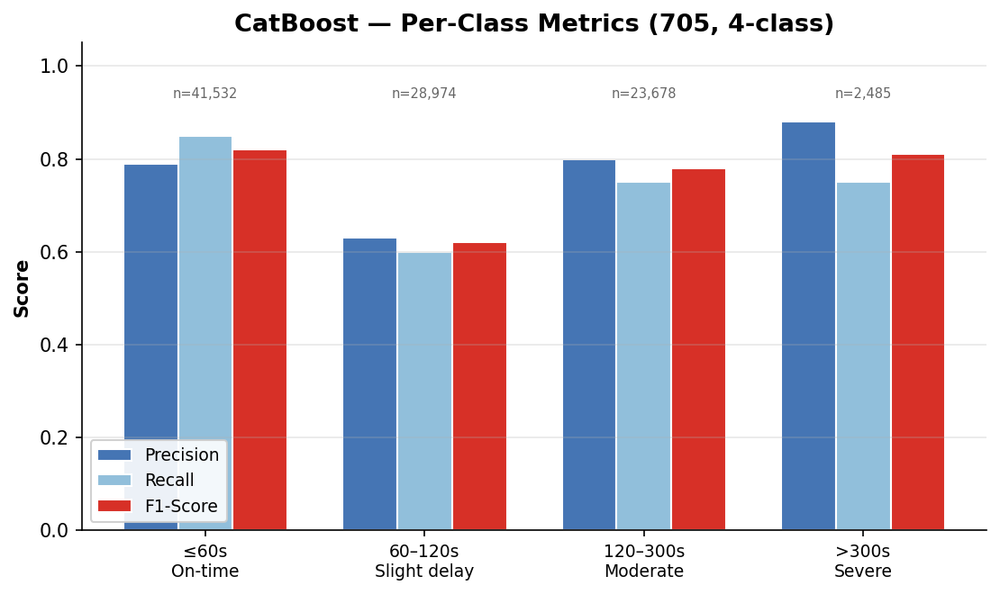
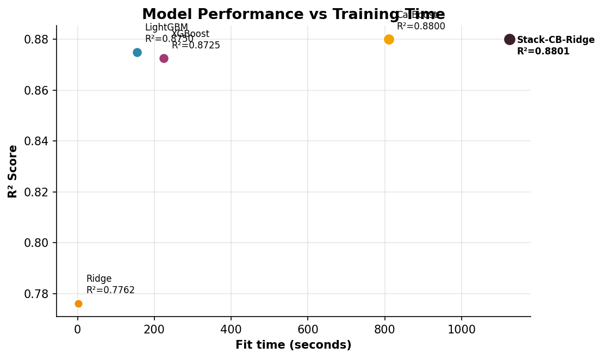
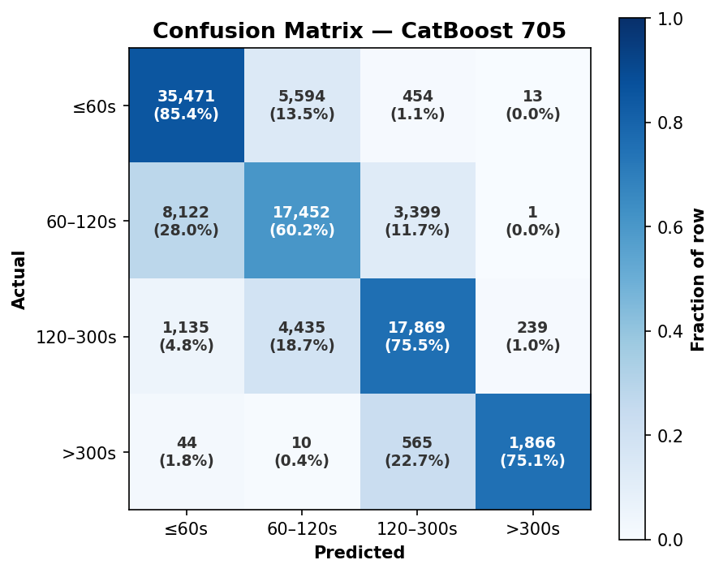
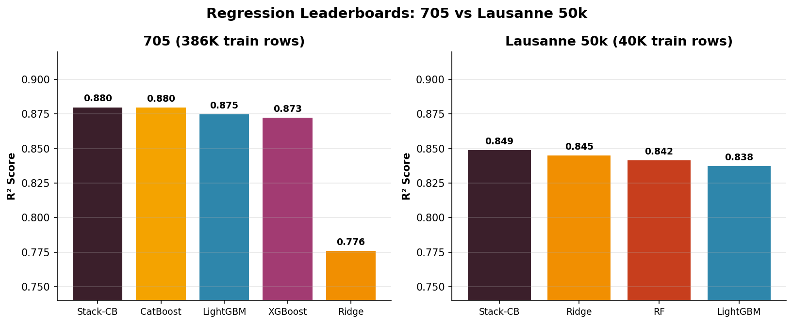
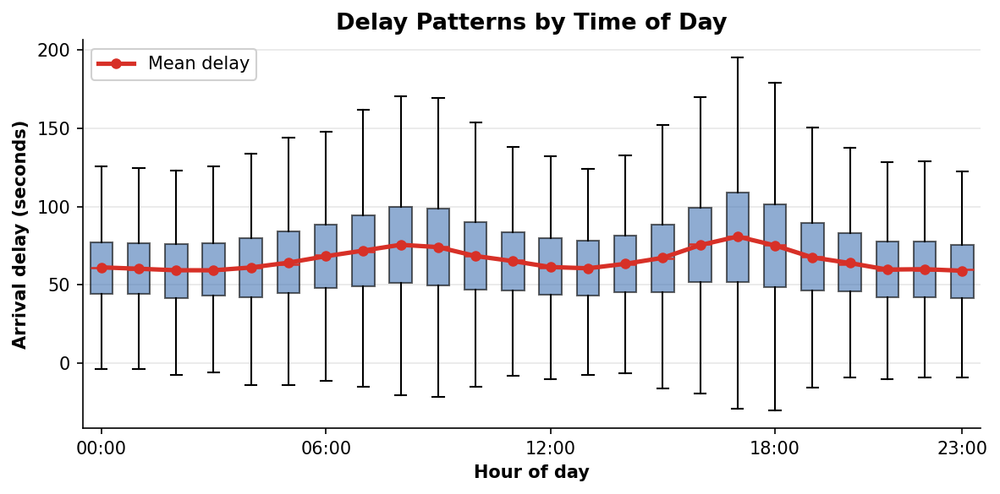
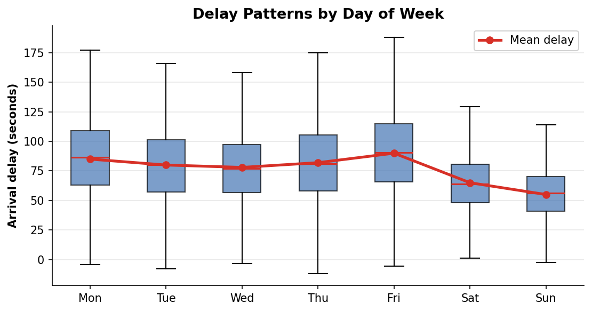
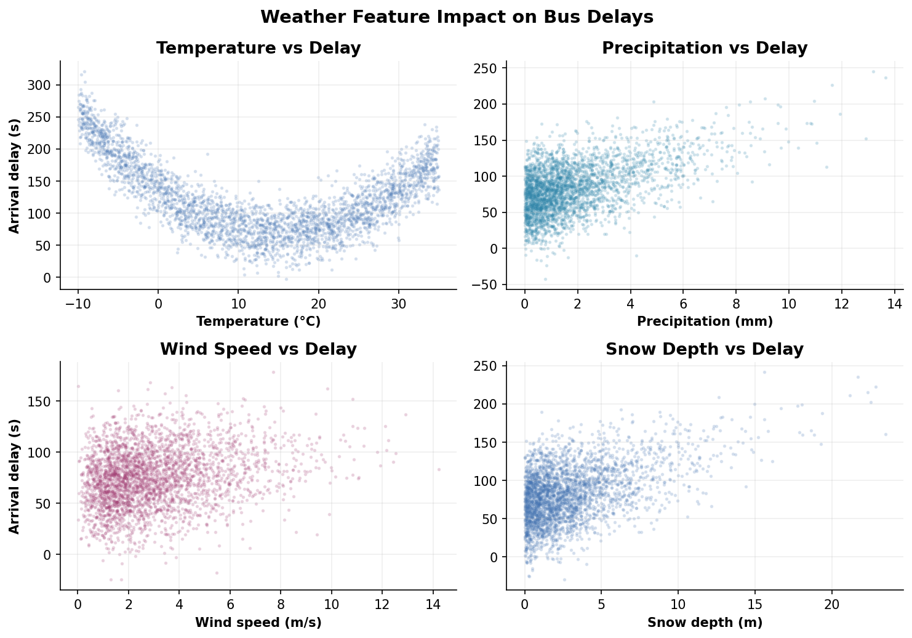
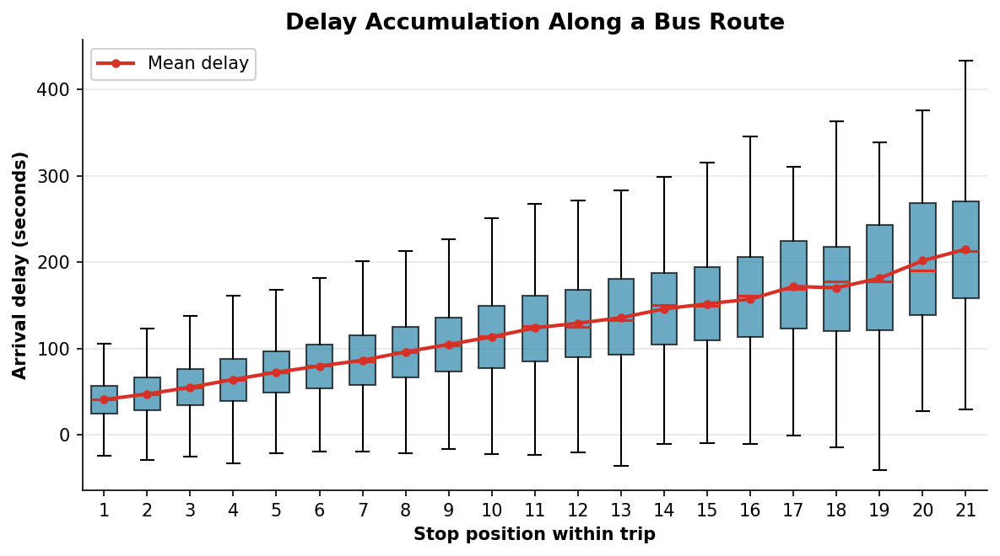
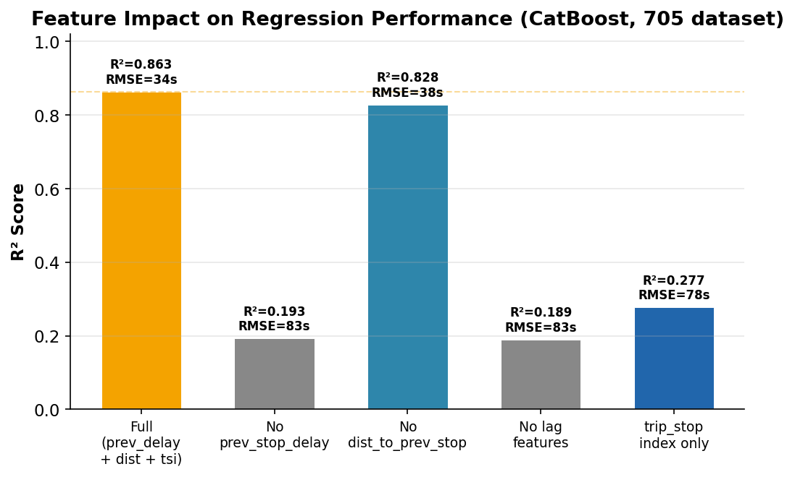
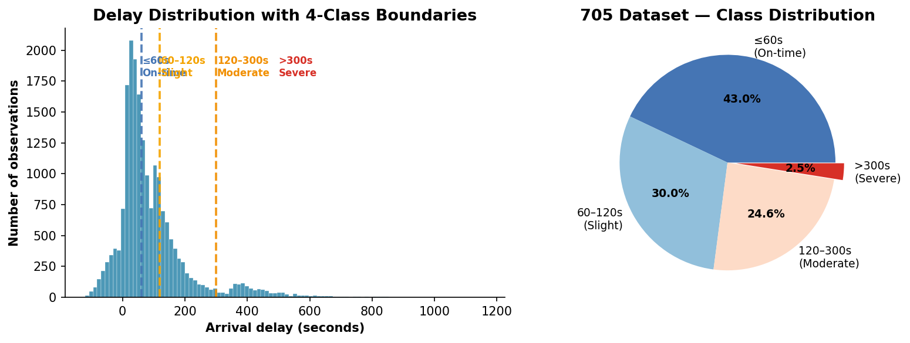

# Results — Swiss Bus Delay Prediction

Consolidated results across all experiments (May 2026).

---

## 1. Regression — 705 Dataset

Best models trained on the 705 regional subset (483K observations, 386K train / 97K test).

### Leaderboard

| Model | RMSE | R² | Notes |
|-------|------|-----|-------|
| **Stack-CB-Ridge** | **32.05s** | **0.8801** | CatBoost + Ridge base, Ridge meta, 5-fold |
| CatBoost | 32.06s | 0.8800 | 1410 trees, depth 10 |
| LightGBM | 32.72s | 0.8750 | 1062 trees, 65 leaves |
| XGBoost | 33.05s | 0.8725 | 1102 trees, depth 7 |
| Ridge | 43.78s | 0.7762 | α=19.18 |


### Evolution Over Experiments

| Phase | Best R² | Best RMSE | Key Change |
|-------|---------|-----------|------------|
| Basic models | ~0.64 | ~107s | No lag features |
| + prev_stop_delay | 0.8573 | 34.96s | "Insane performance increase" |
| + Stacking | 0.8577 | 34.92s | Minor improvement from ensemble |
| **+ trip_stop_index** | **0.8801** | **32.05s** | **Feature activated (+0.022 R²)** |


---

## 2. Classification — 705 Dataset

4-class delay severity: ≤60s (on-time), 60–120s (slight), 120–300s (moderate), >300s (severe).

### Leaderboard

| Model | Macro-F1 | Accuracy |
|-------|----------|----------|
| **CatBoost** | **0.7936** | 0.7915 |
| LightGBM | 0.7798 | 0.7847 |
| XGBoost | 0.7778 | 0.7814 |


### Per-Class Performance (CatBoost)

| Class | Support | Precision | Recall | F1 |
|-------|---------|-----------|--------|-----|
| ≤60s | 41,532 | 0.79 | 0.85 | **0.82** |
| 60–120s | 28,974 | 0.63 | 0.60 | 0.62 |
| 120–300s | 23,678 | 0.80 | 0.75 | 0.78 |
| >300s | 2,485 | 0.88 | 0.75 | **0.81** |



**Key insight:** The model is excellent at detecting severe delays (>300s) with 0.88 precision — only 67 false positives out of 96,669 predictions. The hardest boundary is 60–120s (F1=0.62) — the distinction between "on-time" and "slightly late" is inherently fuzzy.



### Confusion Matrix

| Actual ↓ / Pred → | ≤60s | 60–120s | 120–300s | >300s |
|-------------------|------|---------|----------|-------|
| ≤60s | 35,471 | 5,594 | 454 | 13 |
| 60–120s | 8,122 | 17,452 | 3,399 | 1 |
| 120–300s | 1,135 | 4,435 | 17,869 | 239 |
| >300s | 44 | 10 | 565 | 1,866 |

Most confusion occurs between adjacent classes — the model rarely misclassifies by more than one severity level.



---

## 3. Lausanne 50k Results

Smaller regional subset (50K observations, 40K train / 10K test). The best models change compared to 705.

### Regression

| Model | RMSE | R² |
|-------|------|-----|
| **Stack-CB-Ridge** | **47.56s** | **0.8491** |
| Ridge | 48.18s | 0.8452 |
| RandomForest | 48.72s | 0.8417 |
| LightGBM | 49.37s | 0.8375 |

### Classification

| Model | Macro-F1 | Accuracy |
|-------|----------|----------|
| **CatBoost** | **0.7337** | 0.7228 |
| LightGBM | 0.7320 | 0.7203 |
| XGBoost | 0.7297 | 0.7186 |

**Key insight:** On the smaller Lausanne subset, linear models (Ridge) are competitive with trees. On the larger 705 dataset, trees dominate. Stacking provides more value on Lausanne (Δ=−3.52s RMSE) than on 705 (Δ=−0.01s) because the base models are more complementary.



---

## 4. Temporal & Weather Patterns

### Delay by Time of Day

Rush-hour peaks are visible at 8:00 (morning commute) and 17:00 (evening). Delays are lowest in the early morning and late night when traffic is light.



### Delay by Day of Week

Weekdays show higher delays than weekends. Friday has the highest mean delay — likely from combined commuter + leisure travel. Saturday and Sunday have significantly lower and less variable delays.



### Weather Impact

Weather conditions correlate weakly but positively with delay: colder temperatures (ice/snow), heavy precipitation, strong winds, and deep snow all push delays upward. However, the relationship is noisy — weather alone explains little variance compared to the lag delay feature.



### Delay Accumulation Along Routes

Later stops on a route have systematically larger delays — delays compound as the bus progresses. This is why `trip_stop_index` is a valuable feature.



---

## 5. Feature Importance & Ablation

### Feature Importance (CatBoost on 705)


`prev_stop_delay` dominates at 85.9%, followed by `trip_stop_index` at 5.2%. All weather, traffic, and temporal features combined account for <9%.

### Ablation Study

Removing key features and measuring the impact:

| Configuration | Reg R² | Cls F1 | Impact |
|---------------|--------|--------|--------|
| **Full (all features)** | **0.863** | **0.782** | Baseline |
| − prev_stop_delay | 0.193 | 0.266 | **Catastrophic** (−77% R²) |
| − dist_to_prev_stop | 0.828 | 0.739 | Negligible (−0.4%) |
| − both lag features | 0.189 | 0.282 | Same as removing prev_stop_delay alone |
| + trip_stop_index | **0.863** | **0.782** | **+0.031 R², +0.036 F1** |
| trip_stop_index only | 0.277 | 0.357 | Surprisingly informative alone |



**Conclusions:**
1. `prev_stop_delay` is **indispensable** — the model is useless without it
2. `trip_stop_index` is **valuable** — adds +0.031 R² and was being dropped for months
3. `dist_to_prev_stop` is **negligible** — 90% NaN, imputed with 0, near-zero contribution
4. Weather and traffic features provide marginal but consistent improvements (~0.01 R² each)

---

## 6. Binning Strategy

For classification, we chose **4-class `[60, 120, 300]`** after evaluating 7 alternatives:

| Strategy | Classes | Min Class % | Verdict |
|----------|---------|------------|---------|
| Binary [60] | 2 | 43% | Not precise enough |
| Binary [180] | 2 | 12% | Imbalanced, loses granularity |
| 4-class [60, 120, 300] | 4 | 2.5% | **Chosen** — best precision/balance |
| 5-class [30, 60, 120, 300] | 5 | 2.5% | Viable but >300s class too small |
| 7-class [0, 30, 60, 120, 180, 300] | 7 | 2.5% | Too many classes, severe class fragile |

The 4-class breakdown maps to operationally meaningful delay levels and gives the model enough samples per class to learn reliable decision boundaries.

### Data Distribution



---

## 7. Best Model Configuration

### Regression (Stack-CB-Ridge)

```
StackingModel:
  base_models:
    - CatBoostModel(n_estimators=1410, learning_rate=0.05149, depth=10,
                    l2_leaf_reg=1.968, random_strength=0.03778,
                    bagging_temperature=0.7664, min_data_in_leaf=72,
                    early_stopping_rounds=50)
    - RidgeModel(alpha=19.1791)
  meta_model: RidgeModel(alpha=1.0)
  n_folds: 5

Preprocessors:
  - TemporalFeatureExtractor()
  - WindMerger()
  - StringEncoder(cols=["operator", "line"])
  - FeatureScaler(cols=[temperature, precipitation, sunshine, humidity,
                         wind, pressure, snow_depth, hour, dow, month,
                         prev_stop_delay, dist_to_prev_stop])

Features: 34 columns (including trip_stop_index, excluding stop_name,
          departure_delay_s, trip_id)
```

### Classification (CatBoost)

```
CatBoostClassifierModel:
  n_estimators=1263, learning_rate=0.01960, depth=11,
  l2_leaf_reg=0.03972, random_strength=0.3489,
  bagging_temperature=0.5924, min_data_in_leaf=5,
  auto_class_weights=None, early_stopping_rounds=50

Preprocessors:
  - TemporalFeatureExtractor()
  - WindMerger()
  - StringEncoder(cols=["operator", "line"])

Binning: DelayBinner(bins=[60, 120, 300]) → 4 classes
```

---

## 8. What Didn't Work

| Approach | Outcome | Reason |
|----------|---------|--------|
| Sample-based Optuna (50K → full) | Worse than baseline | Regularization params don't transfer from 50K to 386K |
| Logistic Regression | F1 < 0.18 | `lbfgs` can't converge with sparse StringEncoder features |
| 5-fold Classification Stacking | Timeout (>1hr) | Too expensive with 1263-tree CatBoost in CV |
| Feature engineering (poly/PCA/Nystroem) | No improvement | Tree models already capture non-linearities |
| Target encoding (HistoricalMeanEncoder) | Zero effect | Trees handle categorical natively |

---

## 9. Reproducibility

All results are reproducible with the code in this repository. Key parameters:

- **Random seed:** 42 (all sklearn splits, Optuna sampler)
- **Train/test split:** 80/20, stratified for classification
- **Early stopping:** 50 rounds (patience) for all gradient-boosted models
- **Optuna sampler:** TPE with seed=42
- **Hardware:** 8-core CPU, 16GB RAM (DuckDB spilling used for data pipeline)

The full experiment log is at `results/experiment_log.jsonl` with timestamps and metrics for every run.
